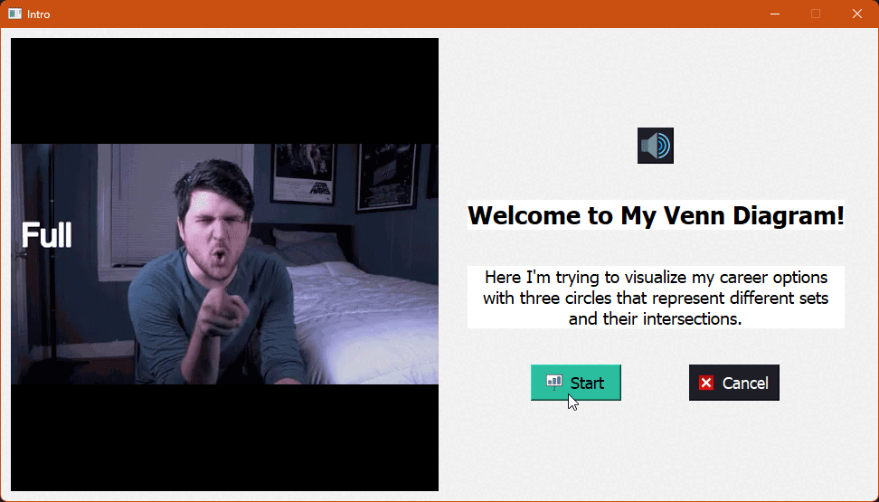
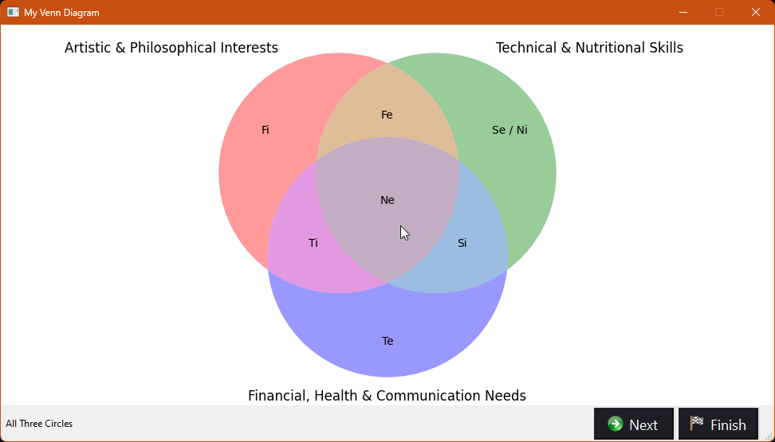

# Welcome to My Venn Diagram!

Here I'm trying to visualize my career options with **three circles** that represent different **sets** and their **intersections**.

The concept for this project was developed since ***January 2023***, and the programming part started in ***May 2023***. It's currently **under development and a work in progress**. 

## Beginning


Here **three circles** represent these following components:

- **Interests circle** demonstrates **artistic** and **philosophical** interests, emphasizing creativity and deep thinking.
- **Skills circle** showcases **technical** skills alongside **nutritional** expertise, demonstrating a **multidisciplinary** approach.
- **Needs circle** encompasses **financial** and **health** needs, emphasizing effective **communication** for holistic solutions.

When the three circles overlap, it will give us **a career option** to choose. In this case, **programming** seems to be the best option to go with:


## Cognitive Functions

The project mainly includes visualizations of using **the MBTI cognitive functions**. Here's a breakdown of the circles and their corresponding functions:

- First Circle: **Fi (Introverted Feeling)** represents an individual's inner values and personal ethics.
- Second Circle: **Se (Extraverted Sensing)** & **Ni (Introverted Intuition)**. Se focuses on gathering concrete information from the environment in the present moment, while Ni helps recognize patterns and understand abstract concepts.
- Third Circle: **Te (Extraverted Thinking)** involves organizing and structuring the external world, making logical decisions, and achieving goals.

### Intersections

By exploring **the intersections of these circles**, we unlock cognitive functions that showcases **MBTI personality traits**. So, **the intersection** of:

- **the first and second circles** gives rise to **Fe (Extraverted Feeling)**, fostering empathy and harmonious interactions.
- **the second and third circles** reveals **Si (Introverted Sensing)**, bringing attention to detail and practicality.
- **the first and third circles** uncovers **Ti (Introverted Thinking)**, promoting logical analysis and problem-solving.
- **all three circles** represents **Ne (Extroverted Intuition)**, encouraging innovation and exploration.


### Conclusion

- **Artistic** and **philosophical** insights to drive innovative solutions.
- **Technical** skills applied in conjunction with nutritional expertise.
- Holistic approach addressing **financial**, **health**, and **communication** needs.
- Emphasis on empathy, attention to detail, logical analysis, and innovation.

## Coding Solution

I'm considering using ``Python`` as my primary programming language for my **data visualization** project due to its versatility and popularity in this field. The project consists of **multiple code files**, each serving a specific purpose:

- `main_window.py` is the main window implementation for **the visualization project**. It utilizes the `PyQt5` library for **GUI development**.
- `all_three_circles.py` creates a visualization with **three circles**; `interests_circle.py` represents **artistic and philosophical interests**, `skills_circle.py` **technical and nutritional skills**, and `needs_circle.py` **financial, health and communication needs**.

Each code file includes functions that generate the respective visualizations using the `Matplotlib` library, which are then rendered using `PyQt5` to display them as interactive widgets.

Additionally, `pygame` library is implemented in order to prevent any potential problems related with audio playback upon clicking the "**speaker**" icon.

## Requirements

- Python 3.x
- PyQt5
- Pygame
- Matplotlib
- Matplotlib_venn

## Usage

1. Clone the project repository to your IDE:
   ```
   git clone https://github.com/kanansnote/My-Venn-Diagram.git
   ```

2. Install the required dependencies. Ensure you have installed the libraries below:
   ```
   pip install pyqt5 pygame matplotlib matplotlib_venn
   ```
   
3. Run the project:
   ```
   python main_window.py
   ```
   
4. The **Introduction Window** will appear with showing a welcome message, an animated GIF, and a description of the project:

<div class="introductionWindow">
   <table>
      <tr>
         <th>Introduction Window</th>
      </tr>
      <tr>
         <td></td>
      </tr>
   </table>
</div>
Click the `Start` button to proceed to the **Visualizations Window**. To exit the application, click the `Cancel` button.

5. In the **Visualizations Window**, you can explore **the visualizations** by the name of the current one on the left side corner:

<div class="visualizationsWindow">
   <table>
      <tr>
         <th>Visualizations Window</th>
      </tr>
      <tr>
         <td></td>
      </tr>
   </table>
</div>

Click the `Next` and `Back` buttons in the status bar to implement the navigation process with all the visualizations.
Click the `Finish` button to end the visualization any time by closing the application.

## License

The project is licensed under the **GNU General Public License (GPL) version 3.0**.

**The GPL** is a popular open-source license that grants users the freedom to use, modify, and distribute the software. It ensures that any derivative works or modifications made to the software are also subject to the GPL, promoting the principles of openness and collaboration.

For more details, please refer to the [full text of the GPL](https://github.com/kanansnote/My-Venn-Diagram/blob/main/LICENSE).

## Additional Info
<div class="additionalInfo">
   <table>
      <tr>
         <th colspan="2">Resources</th>
         <th colspan="6">Icons</th>
      </tr>
      <tr>
         <td>
            <a href="https://academo.org/demos/venn-diagram-generator/">Venn Diagram Generator</a>
         </td>
         <td>
            <a href="https://tenor.com/view/full-circle-olanrogers-youtube-gif-4749604">Full Circle GIF</a>
         </td>
         <td>
            
            <a href="https://icon-icons.com/icon/speaker-sound-volume/54138">Speaker</a>
         </td>
         <td>
            
            <a href="https://icon-icons.com/icon/presentation-board-graph-chart/108631">Start</a>
         </td>
         <td>
            
            <a href="https://icon-icons.com/icon/cancel/73703">Cancel</a>
         </td>
         <td>
            
            <a href="https://icon-icons.com/icon/above-the-arrow/1049">Back</a>
         </td>
         <td>
            
            <a href="https://icon-icons.com/icon/Next-arrow/1058">Next</a>
         </td>
         <td>
            
            <a href="https://www.iconarchive.com/show/farm-fresh-icons-by-fatcow/flag-finish-icon.html">Finish</a>
         </td>
      </tr>
   </table>
</div>
