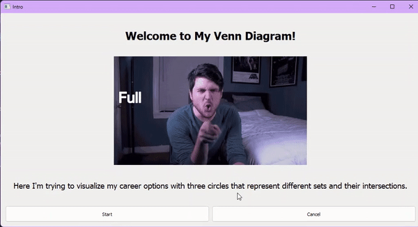
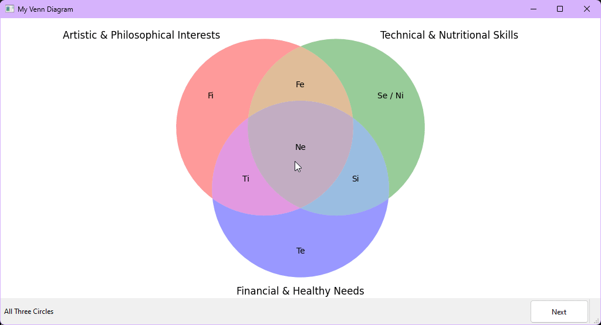
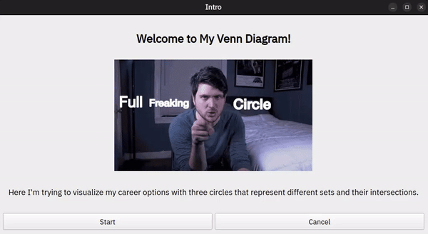
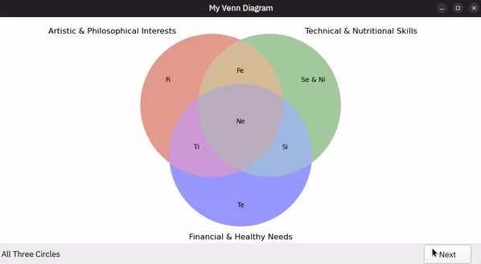

# Welcome to my Venn Diagram!

In this project, I'll try to create a solution by configuring this diagram for visualizing a career path with involving MBTI Cognitive Functions.

The concept for this project was developed since January 2023, and the programming part started in May 2023. It's currently under development and a work in progress. 

## Beginning


Here three circles represents these following components:

- Interests circle demonstrates artistic and philosophical interests, emphasizing creativity and deep thinking.
- Skills circle showcases technical skills alongside nutritional expertise, demonstrating a multidisciplinary approach.
- Needs circle encompasses financial and health needs, emphasizing effective communication for holistic solutions.

When the three circles overlap, it will give us a career option to choose. In this case, programming seems to be the best option to go with:


## Cognitive Functions

The project mainly includes visualizations of using the MBTI cognitive functions. Here's a breakdown of the circles and their corresponding functions:

- First Circle: Fi (Introverted Feeling) represents an individual's inner values and personal ethics.
- Second Circle: Se (Extraverted Sensing) & Ni (Introverted Intuition). Se focuses on gathering concrete information from the environment in the present moment, while Ni helps recognize patterns and understand abstract concepts.
- Third Circle: Te (Extraverted Thinking) involves organizing and structuring the external world, making logical decisions, and achieving goals.

### Intersections

By exploring the intersections of these circles, we unlock cognitive functions that showcases MBTI personality traits:

- The intersection of the first and second circles gives rise to Fe (Extraverted Feeling), fostering empathy and harmonious interactions.
- The intersection of the second and third circles reveals Si (Introverted Sensing), bringing attention to detail and practicality.
- The intersection of the first and third circles uncovers Ti (Introverted Thinking), promoting logical analysis and problem-solving.
- The intersection of all three circles represents Ne (Extroverted Intuition), encouraging innovation and exploration.


### Conclusion

- Artistic and philosophical insights to drive innovative solutions.
- Technical skills applied in conjunction with nutritional expertise.
- Holistic approach addressing financial, health, and communication needs.
- Emphasis on empathy, attention to detail, logical analysis, and innovation.

## Coding Solution

I'm considering using Python as my primary programming language for my data visualization project due to its versatility and popularity in this field. The project consists of multiple code files, each serving a specific purpose:

- `main_window.py` is the main window implementation for the visualization project. It utilizes the `PyQt5` library for GUI development.
- `all_three_circles.py` creates a visualization with three circles; `interests_circle.py` represents artistic and philosophical interests, `skills_circle.py` technical and nutritional skills, and `needs_circle.py` financial, health and communication needs.

Each code file includes functions that generate the respective visualizations using the `Matplotlib` library, which are then rendered using `PyQt5` to display them as interactive widgets.

## Usage

1. Clone the project repository:
    ```
    git clone https://github.com/kanansnote/My-Venn-Diagram.git
    ```

2. Install the required dependencies. Ensure you have `PyQt5` installed:
   ```
   pip install pyqt5
   ```
3. Navigate to the project directory:
   ```
   cd My-Venn-Diagram
   ```
4. Run the project:
   ```
   python main.py
   ```
   
5. The Introduction Window will appear, showing a welcome message, an animated GIF, and a description of the project. Here's how it will look using different OS versions:

<table>
   <tr>
    <th>OS</th>
    <th>Introduction Window</th>
    <th>Visualizations Window</th>
   </tr>
   <tr>
    <th>Windows</th>
    <td></td>
    <td></td>
   </tr>
   <tr>
    <th>Debian</th>
    <td></td>
    <td></td>
   </tr>
</table>

- Click the `Start` button to proceed to the **Visualizations Window**. 
- In the **Visualizations Window**, you can explore different visualizations by clicking the `Next` and `Back` buttons in the status bar, as it will display the name of the current visualization on the left side corner. 
- To exit the application, click the `Cancel` button in the Introduction Window or the `x` icon on both the Introduction and Visualizations windows.

## Tools & Environment
Interpreter: `Python 3.11`\
IDE: `PyCharm 2023.1.4 (Community Edition)`\
OS: `Windows 11` & `Debian 12`

## License

The project is licensed under the GNU General Public License (GPL) version 3.0.

The GPL is a popular open-source license that grants users the freedom to use, modify, and distribute the software. It ensures that any derivative works or modifications made to the software are also subject to the GPL, promoting the principles of openness and collaboration.

For more details, please refer to the [full text of the GPL](https://github.com/kanansnote/My-Venn-Diagram/blob/main/LICENSE).

## Links
<div class="tenor-gif-embed" data-postid="4749604" data-share-method="host" data-aspect-ratio="1.78195" data-width="100%">
    <a href="https://tenor.com/view/full-circle-olanrogers-youtube-gif-4749604">Full Circle GIF</a>
      <br>
    <a href="https://icon-icons.com/icon/speaker-sound-volume/54138">Speaker Icon</a>
</div>